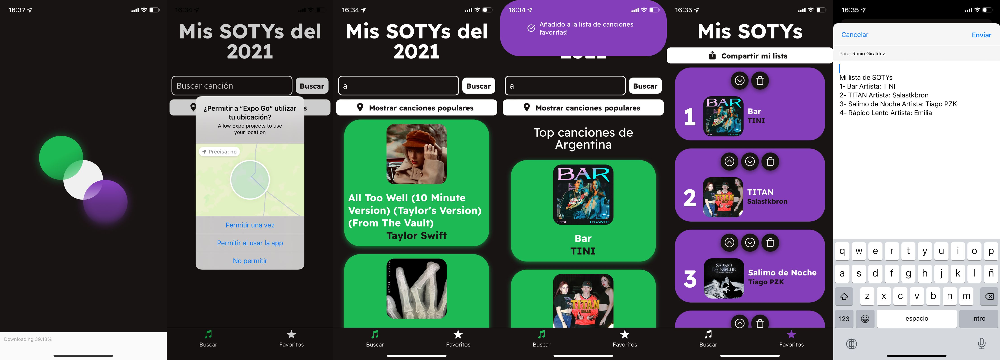

#  My SOTYs

Desarrollado para el curso de React Native de CoderHouse, haciendo uso de Expo. Para la obtención de la información de las canciones se empleó la [API de Spotify](https://developer.spotify.com/documentation/web-api/).
Se complementa con FireBase para la lectura de las keys de las API de Spotify y Google Cloud.

La app permite ir armando una lista con las canciones preferidas (song of the year, mis canciones del año) para luego compartir.

### Pantallas

### Características
- El usuario puede buscar canciones por su nombre o artista, se muestran en pantalla las canciones lanzadas en el año actual.
- En la pantalla de Buscar, al momento de seleccionar una canción se muestra un modal confirmando que se guardo la misma en la lista de canciones.
- Haciendo click en el botón de Mostar canciones populares se despliegan las canciones más populares del país haciendo uso de la ubicación del celular y la API de Reverse geocoding de Google.
- Navegación por tabs, una pantalla de busqueda de canciones y otra que lista las canciones guardadas.
- Persistencia de la lista de SOTYs haciendo uso de Redux persist.
- En la sección de Favoritos, el usuario puede borrar o mover la posición de las distintas canciones que haya seleccionado anteriormente.
- Se puede compartir la lista de canciones seleccionadas en formato texto.
